# Visualizer v2

The 3D output of an `.aqvl` program, rebuilt. The audit of what came before is in
[AUDIT.md](AUDIT.md). The code is in `packages/runtime/src/trace` (recording),
`packages/renderer/src/stage` (the stage) and `packages/demo/src/components/visualizer`
(the UI).

## Before / after

| Before (v1) | After |
|---|---|
| 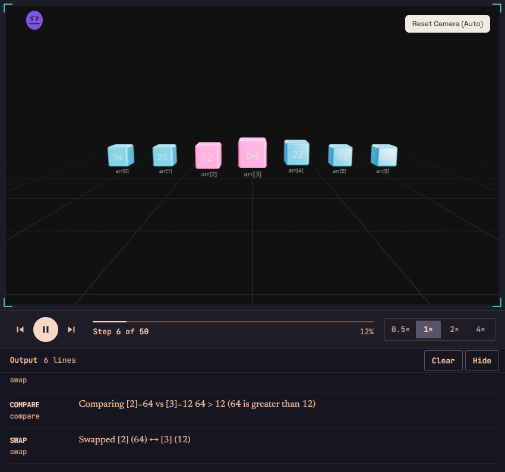 | 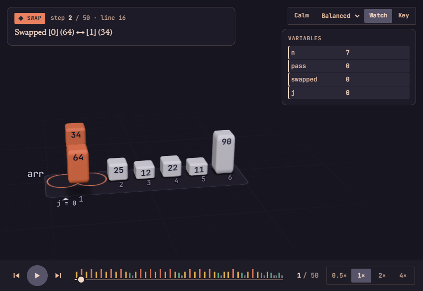 |
| 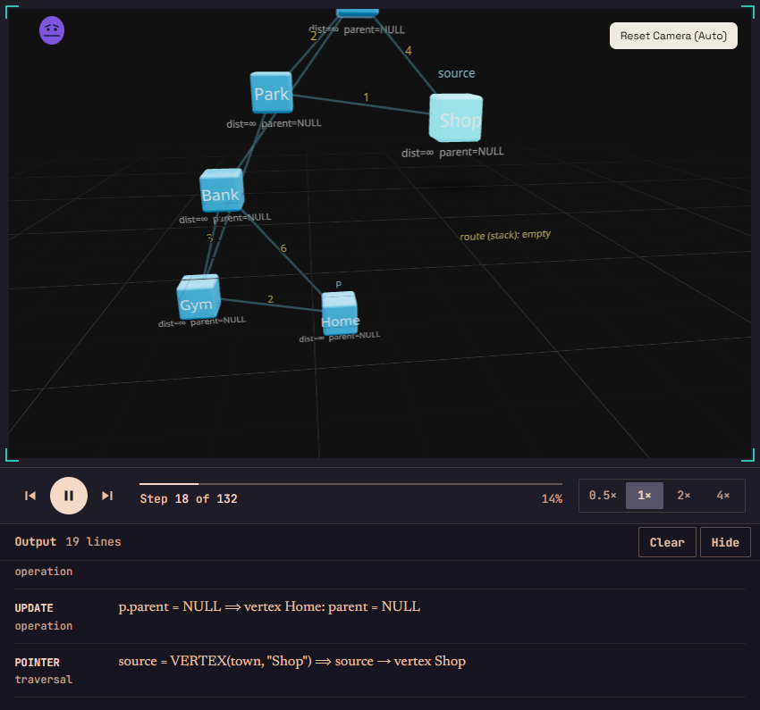 | 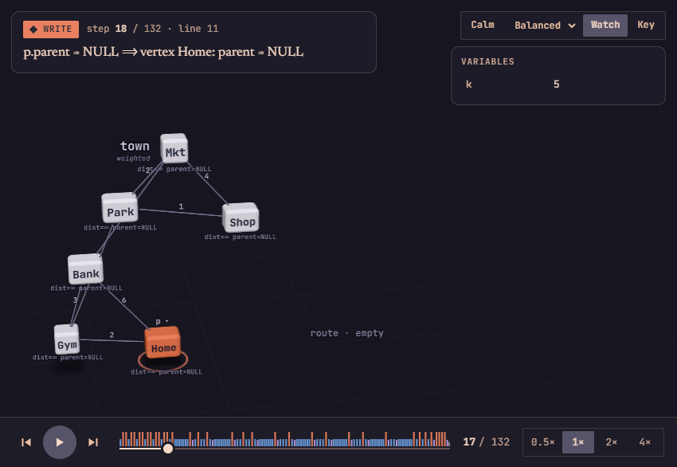 |
| 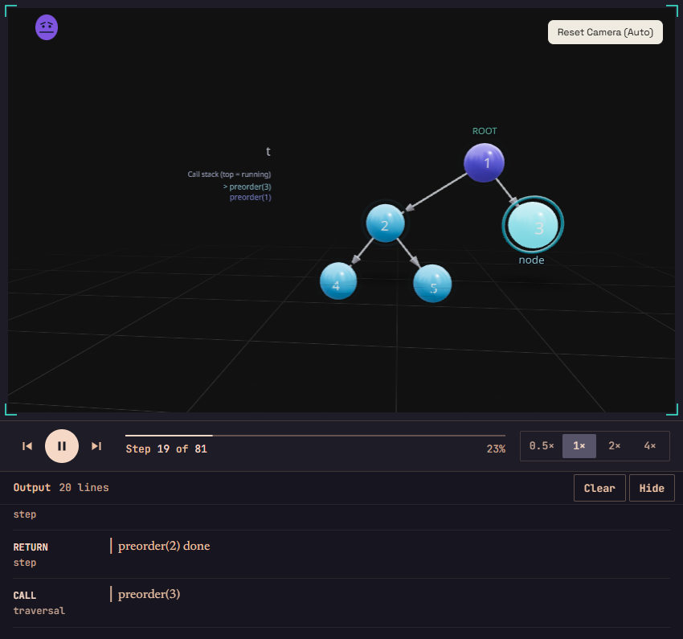 | 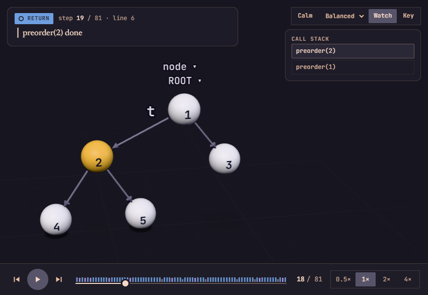 |
| 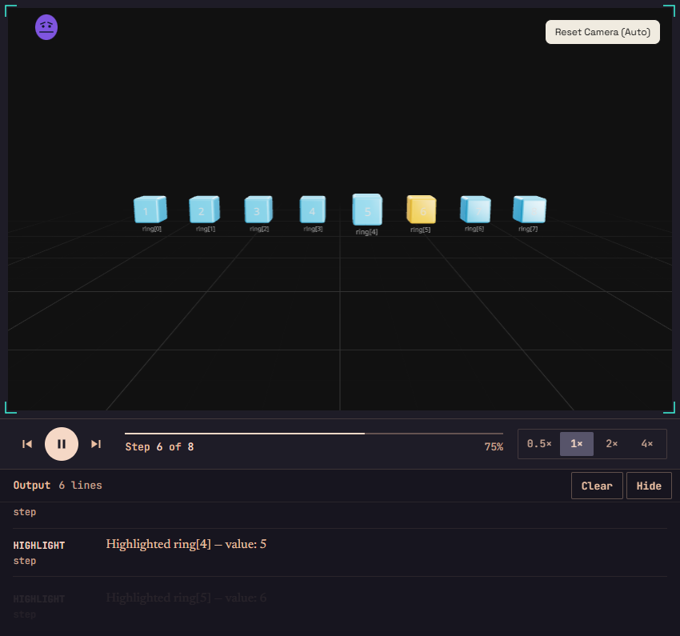 (a `CIRCULAR` layout drawn as a line) | 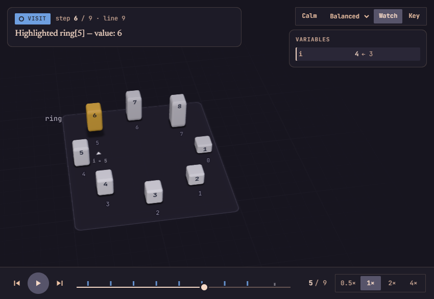 |
| 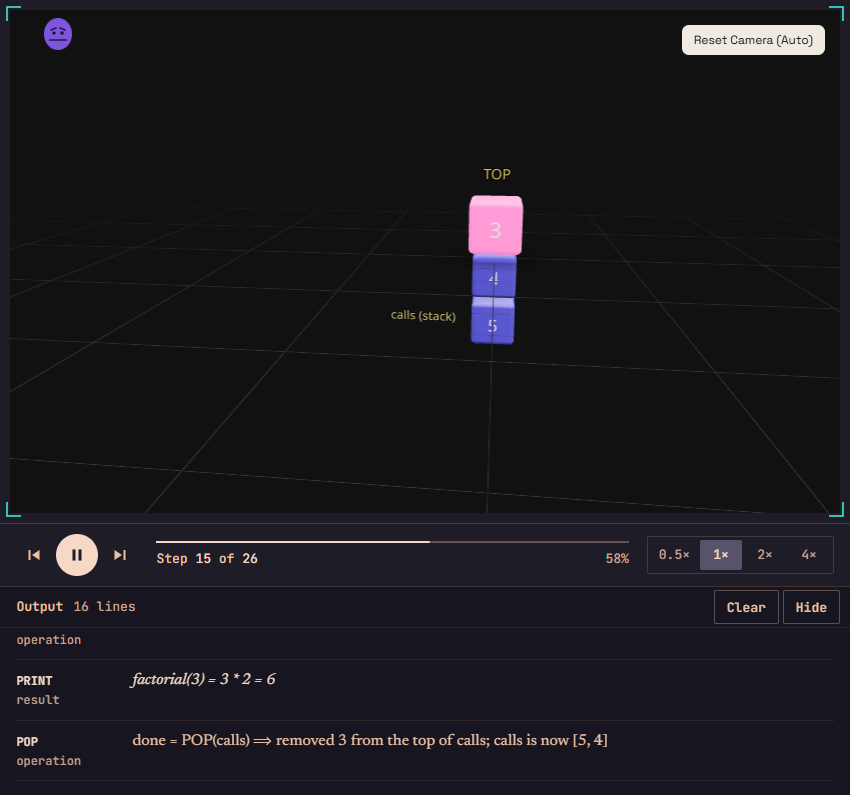 | 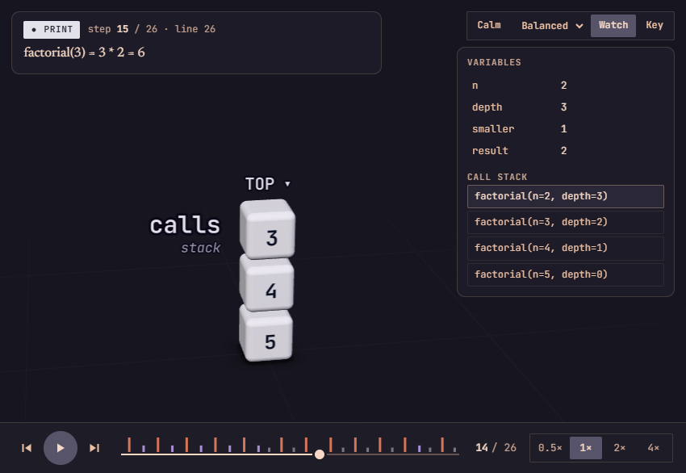 |
| 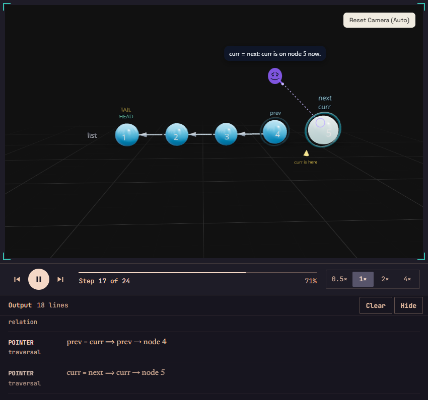 | 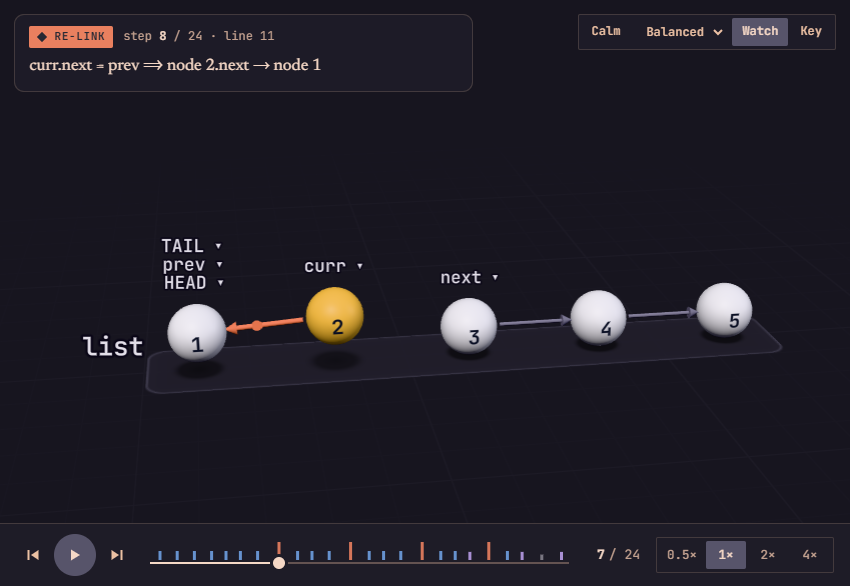 |

The whole page: [after/playground-full.png](after/playground-full.png) (dark) and
[after/playground-light.png](after/playground-light.png) (light). Side-by-side sheets: `compare-*.png`
(v1 / now) and [refinement.png](refinement.png) (the first v2 pass, kept in `v2.0/`, against the
refinement described below).

### The refinement (v2.1)

The first v2 pass worked but looked like a tech demo: grainy, glowing, purple, structures stacked
on top of each other, numbers mirrored under the floor, and a drifting camera that framed off-centre.
The refinement rebuilt the look around one idea: *clean educational software, not a sci-fi
interface.*

* **Layout.** Every structure gets its own place on the floor for the whole run (nothing jumps): side by side in order of first appearance, one clear gap apart, each standing on the floor, its name at its top-left corner. When one row would make everything too small, rows wrap, chosen by which arrangement fills a typical view largest; the tallest row stands at the back and rows are spaced so the one in front never covers the one behind. A program with one structure keeps its own layout. Arrays, queues and hash-map buckets are packed one hand-width apart, so an array reads as one block of memory; hash-map chains get a visible gap per link.
* **Ground.** Nothing goes below the floor. The reflective floor (which mirrored labels under the ground) is gone, captions too close to the floor are printed in front of their node instead of under it, and every floating label is clamped above the floor. Bodies stand on soft shadows drawn straight beneath them, which widen and fade as a body rises.
* **Camera.** One fixed, slightly raised angle (22° over a row, 30° over rows, 42° over structures that lie across the floor), a long 26° lens, no drift, no focus pull, no depth of field. Each step is framed by an exact fit: all eight corners of the content box inside the view with an even margin, then the projected box centred. The box covers three steps either side, so a growing structure is made room for in advance and the camera never pumps.
* **Look.** No bloom, glow, flash, noise, vignette or reflection: multisampling and the renderer's tone mapping only. Satin porcelain bodies, a plain studio light, and a floor the exact colour of the background with a faint fading grid.
* **Labels.** One type scale; values and names in JetBrains Mono SemiBold; a thin knock-out outline so text stays clean where it crosses a line. Weights sit on their edges (they were all drawn at the origin before). Cursors on the same cell merge (`low = high = mid = 0`) and neighbours step forward a row; indices run along the front lip of each structure's tray like a ruler. The 3D call-stack lane appears only when there is nothing else to draw (the inspector already lists the stack).
* **Interaction.** Hovering a node brightens it and shows a tag such as `arr[3] = 34 · compared`.

## Architecture

```
source ──compile──▶ AQIR ──recordTrace()──▶ ExecutionTrace ──▶ StageModel ──▶ sampleStage(step, τ) ──▶ three.js
                          (headless run,      (one frame per     (slots, rest      (pure; preallocated      (instanced
                           SnapTimeline)       visible step)      frames, camera    buffers, no frame        meshes, SDF
                                                                  keys)             history)                 text, shadows)
                                   Playhead (time in "1x seconds") ─────┘
```

* **Kept from v1:** the compiler, the VM, `ExecutionEngine` and `AnimationController`. Their semantics are correct and covered by about 1,600 tests, so `.aqvl` parsing and execution are untouched. The old renderer components still exist (their tests pass) but nothing in the site uses them.
* **`recordTrace`** runs the program once on a `SnapTimelineEngine`, which lands every anime.js tween on its final value. It records one frame per visible step: nodes, edges, structures, sorted / partition regions, simple variables, the call stack, the camera, the runtime's own log line, and an event classified from the state diff (`compare`, `swap`, `write`, `link`, `create`, `remove`, `visit`, `traverse`, `settle`, `discard`, `mark`, `call`, `return`, `print`, `layout`, `camera`, `hold`). WAIT and mid-program LAYOUT / CAMERA changes become steps of their own. A runtime error ends the trace and is reported, never thrown. All 230 examples record in about 3 s together.
* **`Playhead`** is the one clock. Each step has a length by its kind (a swap 1.45 s at 1x, a print 0.55 s). Play, pause, step, step back (the step plays in reverse), scrub and speed all only move a number. Pausing the tab pauses it.
* **`sampleStage`** turns (step, time into it) into every transform, colour, edge curve, travelling light, floor mark and label. It reads only the two rest frames around the step, so scrubbing in any order gives the same picture (tested).
* **Rendering** is one `useFrame` that samples, places the camera, and hands the sample to each part. Bodies are one instanced mesh per shape; edges are instanced rod segments; the floor marks are one instanced SDF quad set. The canvas uses `frameloop="demand"`, so a paused stage draws nothing.

## Libraries, and what each one is for

| Library | Version | Role | Why |
|---|---|---|---|
| three | 0.185.1 | rendering | already in the stack |
| @react-three/fiber | 9.8.1 | React renderer for three | already used; upgraded with drei 10 |
| @react-three/drei | 10.7.7 | `Environment` + `Lightformer`, `OrbitControls`, `Html` (hover tag) | v10 is the major built for fiber 9 (v9 targeted fiber 8) |
| troika-three-text | 0.52.4 | SDF text in the scene | crisp at any distance, used imperatively so labels never re-render React |
| @fontsource/jetbrains-mono | 5.3.0 | the scene's typeface as static `.woff` | the site's code face; preloaded before any text is drawn, and a failed load is reported, not silently replaced |
| motion | 13.5.0 (existing) | DOM UI springs (caption card, speed pill) | the site's UI motion library; not used for anything in 3D |

Deliberately not used in the stage: **GSAP, anime.js, Motion or react-spring for 3D.** They are imperative timelines with their own clocks, so scrubbing and frame-rate independence would have to fight them. The stage's motion is closed-form springs evaluated at a given time (`stage/motion/spring.ts`). Theatre.js is an authoring tool, and nothing here is hand-keyed. The first pass also used `postprocessing` and `@react-three/postprocessing`; the refinement removed both, because the picture no longer needs a post pass. Licences: MIT.

## Colour

**Only the surroundings follow the site's theme**: the background and floor (`--ink-deep` `#17151F` dark, `#EFE4DB` light), the faint grid, the structure trays, the shadows, and the inks printed on the floor (names, captions, cursors, call frames). **The things being visualised keep one palette in both modes**, chosen to sit well on both grounds: porcelain at rest, and soft mid-light hues (none fully saturated) for what is happening. Every body carries the same dark ink `#262833`, so a value reads the same in any state. Edges take their state's colour; idle edges are a quiet grey per theme.

| State | Body | Text contrast | Why this colour | Second cue (not hue) |
|---|---|---|---|---|
| Idle | `#E2E2EA` porcelain | 11.4 | quiet, so anything coloured is news | satin finish, rests on the floor |
| Compared / read | `#EDBB55` amber | 8.3 | "looking at this", warm but not alarming | pair rises; the relation (`64 > 34`) is written above them |
| **Changed** (write, swap, re-link, create, remove) | `#E9805F` coral | 5.4 | the change itself: the warmest, most salient hue | arcs across; one soft floor ripple |
| Visited / pointed at | `#6E9FE0` blue | 5.4 | the walk through the structure, calm and cool | lifts; solid ring |
| Settled / sorted / found | `#5FB389` sage green | 5.8 | done; it accumulates, so it must stay soft | turns matte, slightly smaller |
| Ruled out | `#9C9AA8` grey | 5.3 | the universal "disabled" | smaller (80%), matte |
| Marked | `#B79BE6` lilac | 6.2 | noted, not acted on | dashed ring |
| Role (root, view) | `#7FC2C8` teal | 7.3 | structural | double ring |

**Colour-blind check** (Machado 2009, CIE76 ΔE, `stage/look/vision.ts`): the six core states (idle, compared, changed, visited, settled, ruled out) stay at least ΔE 14.0 apart under protanopia, 19.6 under deuteranopia and 11.8 under tritanopia (26.3 with normal vision); the tests enforce 9.5. Marked and role come closer to visited and settled for some viewers and are told apart by ring shape. No state relies on hue alone.

**Light.** A soft white key from the upper left, a gentle cool fill, a sky / ground hemisphere and a few light panels for the satin finish to catch. The lighting serves readability: the faces of a box read as three clear tones, never as highlights.

## Attention

* `ATTENTION_BUDGET = 2` (`stage/motion/attention.ts`): only a step's first two actors are lifted, haloed, put in focus and, for a mutation, lit. A test checks every frame of a third of the examples.
* Documented exceptions, which are motion rather than emphasis: layout / create / remove cascades move every node they touch (staggered); persistent states (settled, ruled out) colour every node in them; a compare's relation label belongs to its pair.
* The reserved treatment (coral, the swap arc, one floor ripple) appears only in `swap`, `write`, `link`, `create` and `remove` steps. Nothing in the scene glows; a test still checks that no emission appears outside a mutation.

## Motion

* **Springs:** closed form, stiffness 210, damping ratio 0.78 (a barely visible overshoot), mass 0.8–2.2 from the node's value within its structure, so big values settle visibly later. Every spring is windowed to be exactly at rest when its step ends.
* **Swaps:** one node leaves the row to the front and one to the back, then they cross and return. The back one rises higher so neither hides the other. A test samples every swap of bubble sort 60 times and checks no two bodies ever overlap. Landing has a small settle and one ripple.
* **Cascades:** 40 ms per actor, capped. Entrances grow in on a spring; exits shrink to nothing in a cascade, labels and edges included. A new program clears the floor (left to right) before the next builds in.
* **Edges:** draw in, retract, and re-aim (a re-pointed pointer swings from its old target to its new one). The step's edges carry a small dot, in the edge's colour, that travels along them.
* **Calm mode** (on when the OS asks for reduced motion; toggle with C): no arcs, ripples, travelling dots or tilt. Changes cross-fade.

## Camera

See *The refinement* above for the camera: a fixed angle per kind of scene, a 26° lens, an exact box fit with an even margin and a centred projection, and framing that covers ±3 steps. It is keyed to the middle of each step, so it is a pure function of time. Its optical centre is shifted with `setViewOffset`, so the picture centres in the area the caption card and side panel leave free. `CAMERA FOCUS / ORBIT / POSITION` are honoured (an absolute position moves with the structures' new places). Dragging hands control to the viewer; "Recenter" (F) gives it back.

## UI

* **What just happened:** an event chip with a shape per kind (so it works without colour), the step and source line, and the runtime's own sentence in Newsreader. It is announced to screen readers when paused or stepping.
* **Timeline:** one tick per step, coloured and sized by kind, so the swaps' clusters are visible before you reach them. It is a slider with arrow / Page / Home / End keys.
* **Watch:** simple variables (those this step changed are marked with their old value) and the call stack.
* **Key:** each state's colour with its glyph and its non-colour cue.
* **Keyboard:** Space, ← →, Shift + ← → (±10), Home / End, `[` `]` speed, C calm, F follow, K key.
* **States:** tracing progress, compile error, runtime error (shown when playback reaches it; the editor marks the line), WebGL context loss (rebuilt in place, same moment), no WebGL (timeline, captions and variables still work), font failure notice, and a truncation notice beyond 4,000 steps.

## Performance

Measured in Chrome on this machine's integrated GPU (Intel UHD, D3D11), 1440×900, vsync off, playing at 2x (frame intervals):

| Tier | Bubble sort median / p95 | Trie | Kruskal (graph) |
|---|---|---|---|
| High (DPR up to 2) | 1.4 / 2.2 ms | 1.4 / 1.9 ms | 1.8 / 2.9 ms |
| Balanced (DPR up to 1.5) | 1.4 / 1.9 ms | 1.5 / 2.3 ms | 1.8 / 3.0 ms |
| Light (DPR 1) | 1.4 / 1.8 ms | 1.3 / 1.9 ms | 1.7 / 2.8 ms |

The first v2 pass measured 10.5 / 21.8 ms on High for bubble sort. Most of the difference comes from dropping post-processing, reflections and shadow maps in favour of drawn shadows. Every tier now draws the same picture and differs only in resolution and sphere smoothness. A probe still steps down when the 90th-percentile frame exceeds 22 ms. Bodies, edges, shadows, floor marks, rings and dots are instanced; sampling allocates nothing per frame once a step's plan exists; nothing draws while paused.

## Beyond the brief

* **Value bars:** numeric arrays show each value as a height (scaled across the whole run), so order is visible at a glance and a swap visibly moves a tall bar.
* **Event-coded timeline:** see the UI section above.
* **LAYOUT / POSITION / CAMERA** now work. They were silently ignored before.
* **Loop cursors** (`i = 3`, `low … high` window) are derived from the source and the recorded variables for every array program, not only the Loops / Searching categories.

## Checks

```
pnpm test                                   # root suite: 77 files, incl. execution-trace and stage-engine
pnpm --filter demo test && pnpm --filter demo lint && pnpm --filter demo build
pnpm --filter @aqvl/renderer test
npx tsc --noEmit -p packages/renderer && npx tsc -b packages/demo
```

`tests/fixtures/renderer-snapshot.json` (the Skip List / Segment Tree acid tests' pin on `packages/renderer/src`) was regenerated for this rebuild. It was regenerated again for the refinement. Only files under `stage/` changed, and `stage/three/NodeShadows.tsx` was added.
